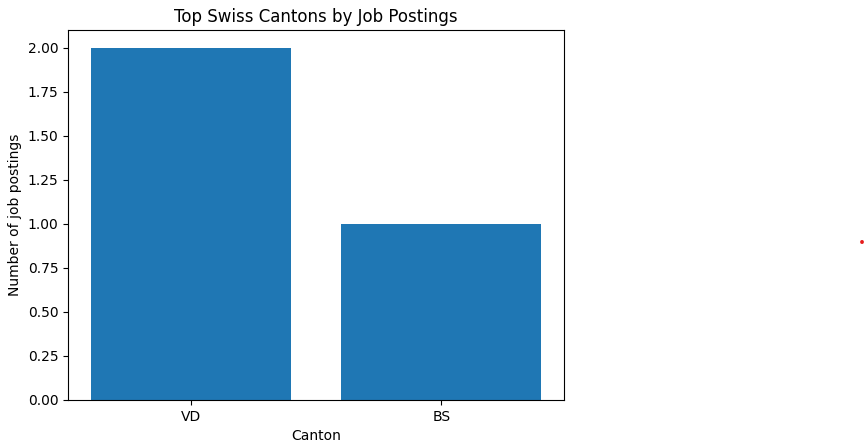

# Swiss Job Market ETL

This project is an end-to-end ETL pipeline that collects job postings
from the Swiss job market, cleans and processes the data, and produces
an analysis-ready dataset.

The goal of the project is to demonstrate practical data engineering
and data analysis skills using real-world data.

---

## Project Overview

The pipeline follows a classic ETL structure:

- **Extract** job postings from the Adzuna API
- **Transform** raw JSON data into a clean tabular format
- **Load** the processed data into CSV files ready for analysis

Additionally, the project includes a lightweight analysis of the Swiss
job market, focusing on demanded technical skills and job distribution
by canton.

---
## Key Insights

#### Top Skills:


#### Job Distribution by Canton:


---

## Project Structure

swiss-job-market-etl/

│

├── src/

│ ├── extract.py # Fetches raw job data from the Adzuna API

│ ├── transform.py # Cleans and normalizes raw job data

│ └── finalize.py # Extracts skills and produces final dataset


│

├── notebooks/

│ └── exploratory_analysis.ipynb # Data analysis and visualizations


├── data/

│ └── processed/ # Clean and final CSV datasets

│

├── requirements.txt

└── README.md


---

## Tech Stack

- Python
- pandas
- requests
- matplotlib
- python-dotenv

---

## How to Run the Pipeline

1. Create and activate a virtual environment
2. Install dependencies:
   ```bash
   pip install -r requirements.txt
3. Run the ETL pipeline:
   ```bash
    python src/extract.py
    python src/transform.py
    python src/finalize.py
4. Explore the results: 
    Clean dataset: data/processed/swiss_jobs_clean.cs
    Final dataset with skills extracted: data/processed/swiss_jobs_final.csv
    Analysis notebook: notebooks/exploratory_analysis.ipynb

---

## Analysis

The notebook exploratory_analysis.ipynb contains:

Most demanded technical skills in Switzerland

Job distribution by canton

Salary distribution (where available)

The analysis is intentionally simple and interpretable, focusing on
real market signals rather than complex models.

---

## Notes

Raw API responses are not committed to the repository

API credentials are managed via environment variables

Salary data availability depends on job postings

---

## Purpose

This project was built as part of a data science portfolio, with a focus
on real-world data pipelines and the Swiss job market.